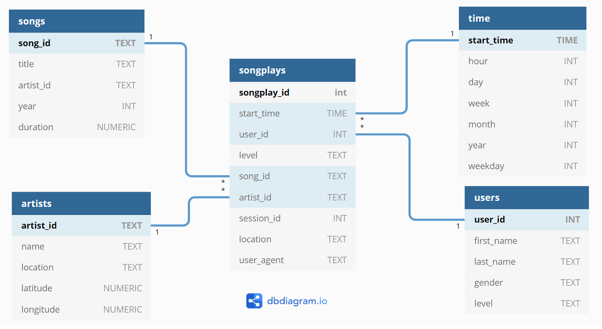

# Sparkify Data ETL
Sparkify is a fictional company whose data(subset of real data from the [Million Song Dataset](https://labrosa.ee.columbia.edu/millionsong/)) is present in the form of JSON files.  
  
This code can perform ETL on the dataset and load all the data into Postgres DB, which can be later used to perform some analytics.  

## Instructions to run:
### Installation:
 - [Install Postgres](https://www.postgresql.org/docs/9.3/tutorial-install.html) and update the following line in `etl.py` according to the Service URL, credentials and DB name:  
`host=127.0.0.1 dbname=sparkifydb user=student password=student`
 - [Install Python3](https://www.python.org/downloads/)
 - [Create a Virtual Environment](https://packaging.python.org/guides/installing-using-pip-and-virtual-environments/#creating-a-virtual-environment)  and activate it(Optional, however recommended)
 - Run pip command to install dependencies  
 `pip install -r requirements.txt`
 
 ### To Run:
 - To initialize DB, run `python create_tables.py`
 - To start ETL process run `python etl.py`

## Schema for Song Play Analysis
Fact and dimension tables were defined for a star schema for analytics purposes.  

#### Fact Table
* `songplays`: records in log data associated with song plays i.e. records with page NextSong
*songplay_id, start_time, user_id, level, song_id, artist_id, session_id, location, user_agent*

#### Dimension Tables
* `users`: users in the app
*user_id, first_name, last_name, gender, level*
* `songs`: songs in music database
*song_id, title, artist_id, year, duration*
* `artists`: artists in music database
*artist_id, name, location, lattitude, longitude*
* `time`: timestamps of records in songplays broken down into specific units
*start_time, hour, day, week, month, year, weekday*

## Files in Project
The main files for running the project are:
1.  `test.ipynb`  displays the first few rows of each table to let you check database.
2.  `create_tables.py`  drops and creates tables. You run this file to reset your tables before each time you run ETL script(`etl.py`)
3.   `etl.ipynb`  reads and processes a single file from  `song_data`  and  `log_data`  and loads the data into tables. This notebook contains detailed instructions on the ETL process for each of the tables.
4.  `etl.py`  reads and processes files from  `song_data`  and  `log_data`  and loads them into tables.
5.  `sql_queries.py`  contains all SQL queries, and is imported into the last three files above.